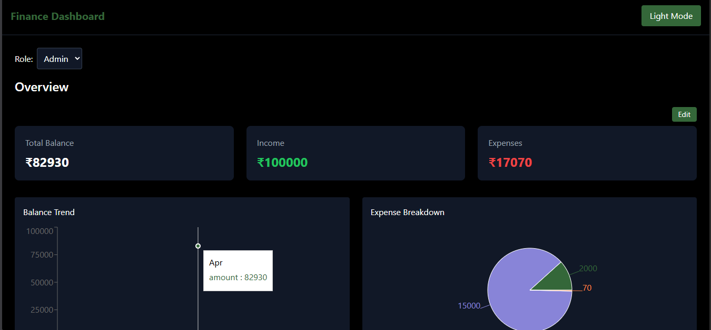
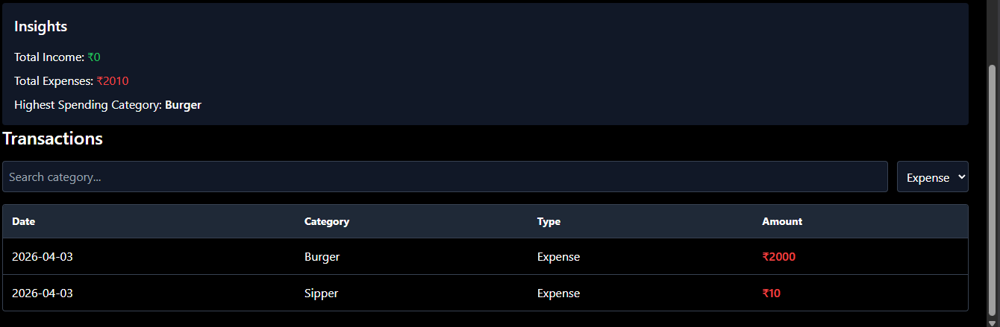
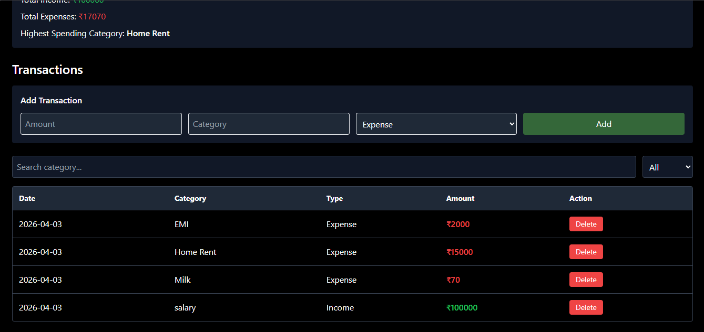

# 💰 Finance Dashboard UI

## 📸 Screenshots

### Dashboard



### Insights



### Transactions



A clean and interactive **Finance Dashboard** built using **React + Tailwind CSS**.
This project allows users to track financial activity, visualize spending patterns, and manage transactions with a simple and responsive interface.

---

## 🚀 Features

### 📊 Dashboard Overview

* Total Balance, Income, Expenses cards
* Dynamic updates based on transactions
* Editable summary (Admin only)
* Persistent data using localStorage

### 📈 Visualizations

* **Balance Trend (Line Chart)** — based on real transaction data
* **Expense Breakdown (Pie Chart)** — category-wise spending

### 📋 Transactions

* Add new transactions (Admin)
* Delete transactions with confirmation
* Search by category
* Filter by Income/Expense
* Responsive table layout

### 🔐 Role-Based UI

* **Viewer**

  * Can only view data
* **Admin**

  * Can add/delete transactions
  * Can edit summary values

### 💡 Insights Section

* Highest spending category
* Total income and expenses
* Useful financial observations

### 🌙 Dark Mode

* Toggle between light and dark theme
* Theme preference saved in localStorage

### 💾 Data Persistence

* Transactions saved in localStorage
* Summary edits saved
* Theme & role preserved after refresh

---

## 🛠️ Tech Stack

* **React (Vite)**
* **Tailwind CSS**
* **Recharts (for charts)**
* **LocalStorage (for persistence)**

---

## 📱 Responsive Design

* Works on mobile, tablet, and desktop
* Optimized layouts for smaller screens
* Scrollable tables and stacked inputs

---

## 📂 Project Structure

```
src/
│
├── components/
│   ├── Navbar.jsx
│   ├── SummaryCards.jsx
│   ├── Transactions.jsx
│   ├── Charts.jsx
│   ├── Insights.jsx
│   └── RoleSwitcher.jsx
│
├── App.jsx
└── main.jsx
```

---

## ⚙️ Setup Instructions

1. Clone the repository

```bash
git clone https://github.com/your-username/finance-dashboard.git
cd finance-dashboard
```

2. Install dependencies

```bash
npm install
```

3. Run the project

```bash
npm run dev
```

---

## 🎯 Key Highlights

* Clean and modular component structure
* Proper state management using React hooks
* Real-time UI updates based on user actions
* Role-based interaction control
* Good UX with confirmation dialogs and feedback

---

## 📌 Future Improvements

* Export transactions (CSV/JSON)
* Better analytics & insights
* Backend integration
* Authentication system

---

## 👨‍💻 Author

**Karan Sharma**

---

## ⭐ Notes

This project was built as part of a frontend assignment to demonstrate:

* UI design thinking
* Component structuring
* State management
* User experience design

---
